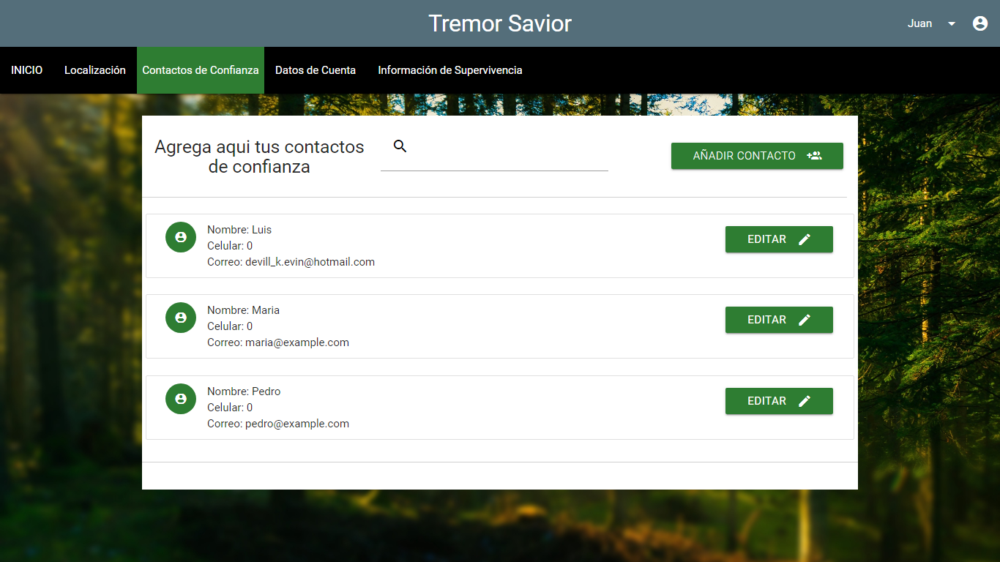
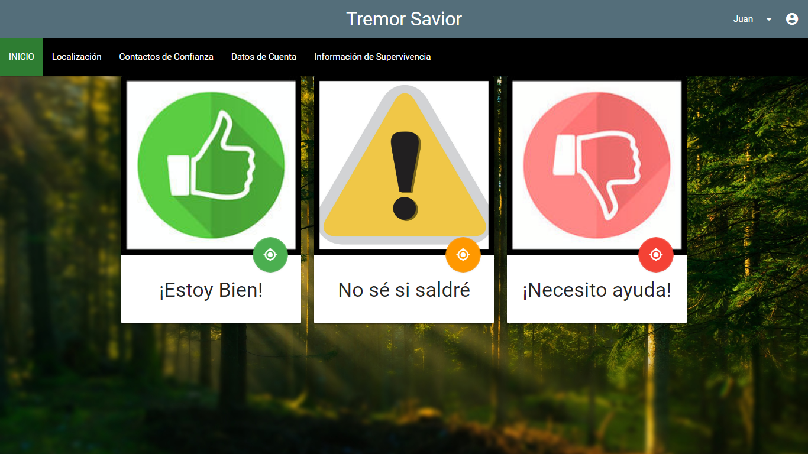
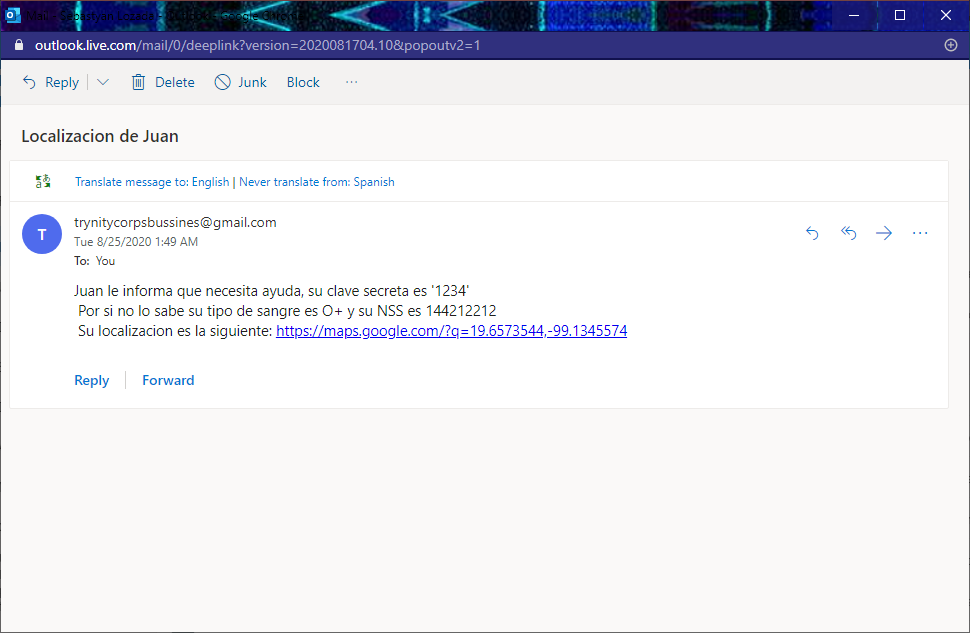

# Tremor-Savior
## Description
WEB SIMULATION of a mobile security app project designed to decrease the number of missing people after an earthquake and facilitate the access to
people’s basic medical data in case of emergency
## Features
### Trusted contacts in case of emergecy

### Share information in case of emergency

 
